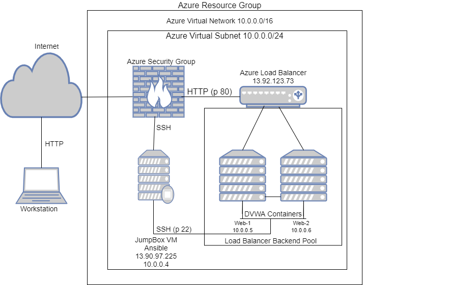
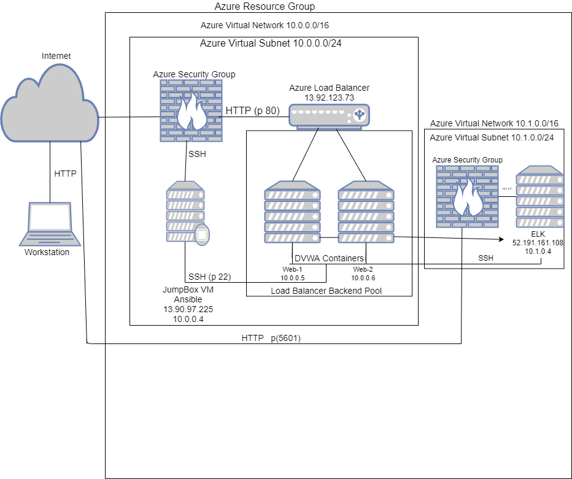
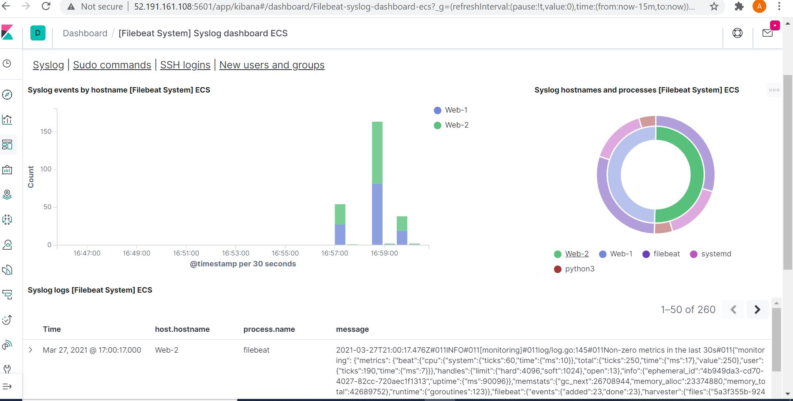
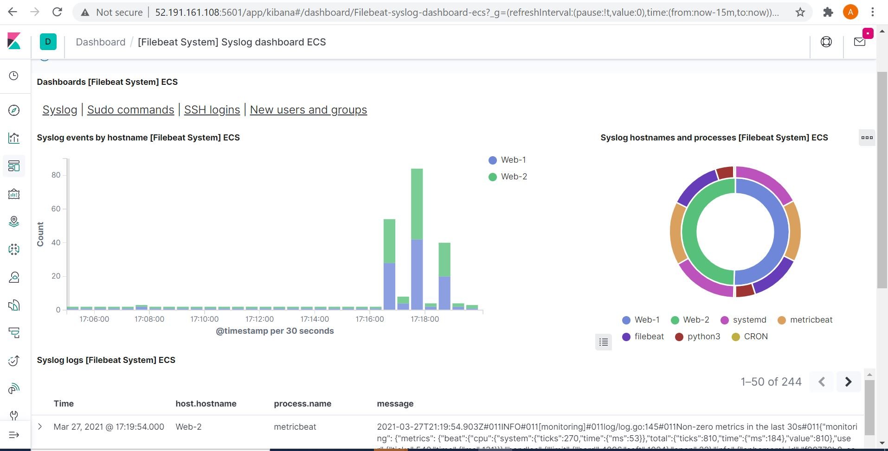
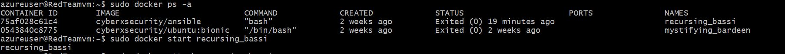

# ELK-STACK-PROJECT
## Automated ELK Stack Deployment

The files in this repository were used to configure the network depicted below.

These files have been tested and used to generate a live ELK deployment on Azure. They can be used to either recreate the entire deployment pictured above. Alternatively, select portions of the playbook file may be used to install only certain pieces of it, such as Filebeat.

-_[install filebeat](Ansible/filebeat-playbook.yml)
-_[install metricbeat](Ansible/metricbeat-playbook)
-_[install Apache](Ansible/Apache-playbook)
-_[install Docker](Ansible/Docker-playbook)
-_[install Elk-vm](Ansible/Elk-vm-playbook)
-_[install Web-vm](Ansible/Webvm-playbook)

This document contains the following details:
- Description of the Topology
- Access Policies
- ELK Configuration
  - Beats in Use
  - Machines Being Monitored
- How to Use the Ansible Build

### Description of the Topology

The main purpose of this network is to expose a load-balanced and monitored instance of DVWA, the D*mn Vulnerable Web Application.

Load balancing ensures that the application will be highly flexible, in addition to restricting Bad actors to the network.
-  What aspect of security do load balancers protect? What is the advantage of a jump box?_
    it protects the webservers and ensures that the webserver does not get overloaded by distributing traffic evenly across the webservers, the jumpbox helps with securing the internal network from bad actors and it creates an extra layer of security to the internal components. 
Integrating an ELK server allows users to easily monitor the vulnerable VMs for changes to the files and system logs.
-  What does Filebeat watch for? it watches out for system logs
-  What does Metricbeat record?_ it watches out for operating system  e.g Ram, system usage.

The configuration details of each machine may be found below.
_Note: Use the [Markdown Table Generator](http://www.tablesgenerator.com/markdown_tables) to add/remove values from the table_.

| Name     | Function | IP Address | Operating System |
|----------|----------|------------|------------------|
| Jump Box | Gateway  | 10.0.0.1   |      Linux       |
| Web 1    |   Host   | 10.0.0.5   |      Linux       |
| Web 2    |   Host   | 10.0.0.6   |      linux       |
| Elk-VM   |   Host   | 10.1.0.4   |      Linux       |

### Access Policies

The machines on the internal network are not exposed to the public Internet. 

Only the jumpbox machine can accept connections from the Internet. Access to this machine is only allowed from the following IP addresses:
- Add whitelisted IP addresses_: my jumpbox IP address(13.90.97.225)

Machines within the network can only be accessed by my jumpbox.
-  Which machine did you allow to access your ELK VM? What was its IP address? my jumpbox  13.90.97.225

A summary of the access policies in place can be found in the table below.

| Name     | Publicly Accessible | Allowed IP Addresses |
|----------|---------------------|----------------------|
| Jump Box |    Yes              | 13.90.97.225         |
| Elk-vm   |    Yes              | 52.191.161.108       |
|          |                     |                      |

### Elk Configuration

Ansible was used to automate configuration of the ELK machine. No configuration was performed manually, which is advantageous because...
- _TODO: What is the main advantage of automating configuration with Ansible?_
faster deployment of software
Helps in software automation
The playbook implements the following tasks: it was used to install the ELK container, python, docker.io, file and metric beats.
- : In 3-5 bullets, explain the steps of the ELK installation play. E.g., install Docker; download image; etc._
- Deploying containers using Ansible and Docker.
- Deploying Filebeat using Ansible.
- Deploying the ELK stack on a server.

The following screenshot displays the result of running `docker ps` after successfully configuring the ELK instance.

### Target Machines & Beats
This ELK server is configured to monitor the following machines: web servers
- List the IP addresses of the machines you are monitoring_
   10.0.0.5
   10.0.0.6
   10.1.0.4

We have installed the following Beats on these machines:
- Specify which Beats you successfully installed: filebeats and metric beats

These Beats allow us to collect the following information from each machine:
- _TODO: In 1-2 sentences, explain what kind of data each beat collects, and provide 1 example of what you expect to see. E.g., `Winlogbeat` collects Windows logs, which we use to track user logon events, etc._

### Using the Playbook
In order to use the playbook, you will need to have an Ansible control node already configured. Assuming you have such a control node provisioned: 

SSH into the control node and follow the steps below:
- Copy the `/etc/ansible/files/filebeat-config.yml` file to `/etc/filebeat/filebeat.yml`.
- Update the `/etc/ansible/hosts` file to include webservers
- Run the playbook, and navigate to `/etc/filebeat`to check that the installation worked as expected.

 Answer the following questions to fill in the blanks:_
- _Which file is the playbook? Where do you copy it? `/etc/ansible/roles`
- _Which file do you update to make Ansible run the playbook on a specific machine? How do I specify which machine to install the ELK server on versus which to install Filebeat on?_`/etc/ansible/hosts` 
- _Which URL do you navigate to in order to check that the ELK server is running? http://52.191.161.108:5601/app/kibana#/home

_As a **Bonus**, provide the specific commands the user will need to run to download the playbook, update the files, etc._